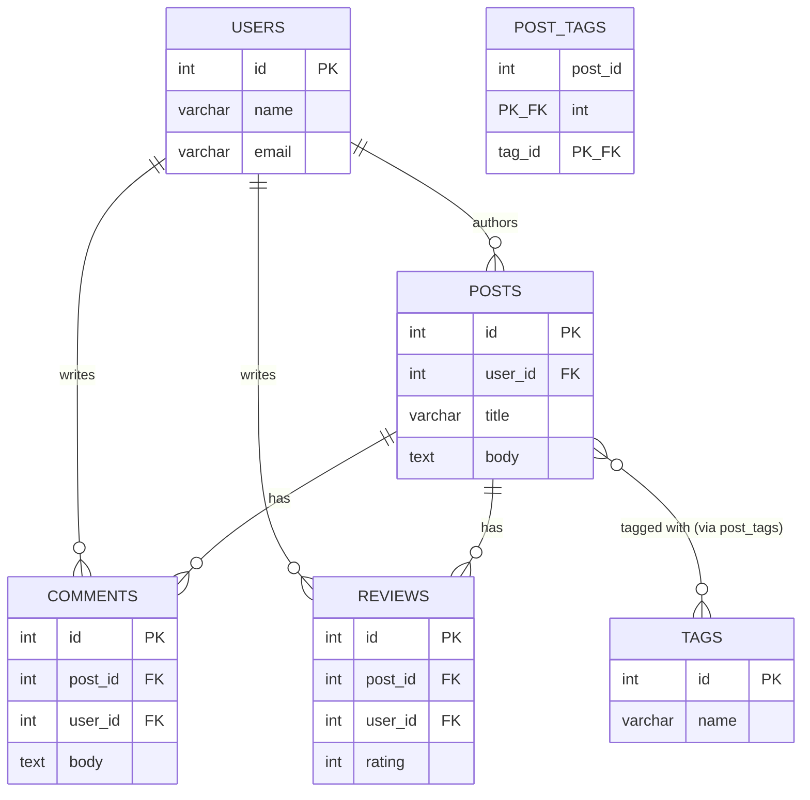

# Database Design Document — Blogging Platform (SQL / PostgreSQL)

## 1. Overview

This document covers the relational (PostgreSQL) database design for
the Smart Blogging Platform, submitted as the final database
implementation for this project (see `analysis-report.md` for the
reasoning behind choosing PostgreSQL over the MongoDB alternative
that was also built and evaluated during development, backed by the
raw measurements in `performance-report-comparison.md`).

The design follows the three-stage modeling process required by the
project brief: a **conceptual model** (entities and relationships),
a **logical model** (attributes, keys, cardinality), and a
**physical model** (actual SQL types and constraints, normalized to
3NF).

## 2. Conceptual Model

Five core entities were identified: **Users, Posts, Comments,
Reviews, Tags**. Their relationships:

- **Users → Posts**: one-to-many (one user authors many posts)
- **Posts → Comments**: one-to-many (one post has many comments);
  **Comments → Users**: many-to-one (many comments can be written
  by the same user)
- **Posts → Reviews**: one-to-many; **Reviews → Users**: many-to-one
- **Posts ↔ Tags**: many-to-many (one post can have several tags;
  one tag can apply to many posts)

The many-to-many Posts↔Tags relationship requires a **junction
table** (`post_tags`), since a single foreign key column cannot
represent a relationship where both sides can have multiple
matches.



This diagram is generated directly from `schema.sql`'s `CREATE TABLE`
statements (same column names, same keys) and is the **single source
of truth** for the data model — any future schema change must update
this diagram in the same commit, so the design artifact and the
implementation can never drift apart again. `POST_TAGS` is drawn as
its own entity, with both `post_id` and `tag_id` marked `PK_FK`, to
make the many-to-many relationship and its junction table explicit
rather than implied by prose.

## 3. Logical Model

| Entity | Primary Key | Foreign Keys | Key Attributes |
|---|---|---|---|
| users | id | — | name, email (unique) |
| posts | id | user_id → users(id) | title, body |
| comments | id | post_id → posts(id), user_id → users(id) | body |
| reviews | id | post_id → posts(id), user_id → users(id) | rating |
| tags | id | — | name (unique) |
| post_tags | (post_id, tag_id) *composite* | post_id → posts(id), tag_id → tags(id) | — |

`post_tags` uses a **composite primary key** — the pair
`(post_id, tag_id)` together, rather than a separate auto-incrementing
`id` — because the meaningful uniqueness constraint is "this
post/tag pairing has not already been recorded," not an arbitrary
row number. This was verified directly: attempting to insert the
same `(post_id, tag_id)` pair twice is rejected by the primary key
constraint.

## 4. Physical Model (3NF)

All tables satisfy Third Normal Form:
- Every column holds a single, atomic value (1NF) — this is
  precisely why `tags` could not be a comma-separated list on
  `posts`; a proper `tags` table plus `post_tags` junction table
  was required instead.
- Composite-key tables (`post_tags`) have no non-key attributes,
  avoiding partial-key dependency issues (2NF).
- No column depends on a non-key column of the same table (3NF) —
  for example, an author's email is never duplicated onto `posts`;
  it is always resolved through the `user_id` foreign key.

Full `CREATE TABLE` statements, including constraints, are in
`sql-postgresql/schema.sql`.

### Key constraints applied

- **`NOT NULL`** on required fields (title, body, rating, etc.) —
  enforced at the database level, in addition to Service-layer
  validation in the Java application (defense in depth: the
  application should reject invalid input first, for good user
  feedback, but the database itself never accepts it either way).
- **`UNIQUE`** on `users.email` and `tags.name` — prevents duplicate
  registrations and duplicate tag names.
- **`CHECK (rating >= 1 AND rating <= 5)`** on `reviews.rating` —
  the direct SQL equivalent of the `$jsonSchema` validator used on
  the MongoDB implementation's `reviews` collection. Verified by
  attempting to insert `rating = 999`, which PostgreSQL rejected
  immediately with a constraint violation error.
- **Foreign keys** on every reference column — verified by attempting
  to insert a `comments` row with a `post_id` that does not exist,
  which PostgreSQL rejected automatically. This is a structural
  advantage over the MongoDB implementation, where an equivalent
  invalid reference is accepted silently by default.

## 5. Indexing (User Story 1.2)

Indexes were added on the columns the application queries or
filters by frequently:

```sql
CREATE INDEX idx_posts_user_id ON posts(user_id);
CREATE INDEX idx_posts_title ON posts(title);
CREATE INDEX idx_comments_post_id ON comments(post_id);
CREATE INDEX idx_reviews_post_id ON reviews(post_id);
CREATE INDEX idx_tags_name ON tags(name);
```

Primary key columns (`id` on every table) are indexed automatically
by PostgreSQL and required no explicit action.

Measured impact of indexing `posts.user_id`: a query for a single
author's post, out of ~5,000 posts, went from a full sequential scan
(5,004 rows unnecessarily checked, 1.914 ms) to an index scan (0 rows
unnecessarily checked, 0.250 ms). Full results in
`performance-report-comparison.md`.

### Indexing coverage across all tables

Optimization was not limited to `posts` — every table that the
application filters or searches by has a matching index:

| Table | Indexed column | Why |
|---|---|---|
| posts | user_id | "posts by this author" (search, reports) |
| posts | title | case-insensitive title search (`ILIKE`) |
| comments | post_id | "comments for this post" (loaded on every post selection) |
| reviews | post_id | "reviews for this post" |
| tags | name | tag lookup by name (duplicate check, search-by-tag) |
| post_tags | (post_id, tag_id) composite PK | also serves as the index backing both the "tags for a post" and "posts for a tag" joins |

`CachePerformanceTest.java` times the comments-by-post and
search-by-tag queries in addition to the Post cache, so the
performance report is not posts-only. See `performance-report-comparison.md`.

## 6. Data Flow — Worked Example

To make the JavaFX → Service → DAO → Database call chain concrete
(rather than just described in the abstract), here is one full
request traced end-to-end: **clicking "Next" to page through posts**.

1. **JavaFX (Controller)** — `BlogApp`'s `nextButton.setOnAction`
   handler increments `currentPage` and calls `loadPage()`.
2. **`loadPage()`** calls `postService.getPostsPage(currentPage,
   PAGE_SIZE)` and `postService.getTotalPages(PAGE_SIZE)`.
3. **Service** — `PostService.getPostsPage` performs no business
   logic itself (pagination has no invalid state to reject) and
   delegates straight to `postDAO.findPostsPaginated(pageNumber,
   pageSize)`. `getTotalPages` calls `postDAO.countAllPosts()` and
   divides by `pageSize`, rounding up.
4. **DAO** — `PostDAO.findPostsPaginated` builds the parameterized SQL
   `SELECT * FROM posts ORDER BY id LIMIT ? OFFSET ?`, computes
   `offset = (pageNumber - 1) * pageSize`, executes it, and maps each
   `ResultSet` row into a `Post` object.
5. **Database** — PostgreSQL executes the `LIMIT`/`OFFSET` query
   against the `posts` table (using the primary key index for the
   `ORDER BY id`) and returns exactly `PAGE_SIZE` rows (or fewer, on
   the last page).
6. **Back up the chain** — the `List<Post>` returns unchanged through
   `PostDAO` → `PostService` → `BlogApp`, which clears
   `postListView`/`titleToPostMap` and repopulates them, then updates
   `pageLabel` to `"Page X of Y"` and disables `nextButton`/
   `prevButton` at the first/last page boundary.

Every other feature in the application (tags, comments, reviews, the
analytics report) follows this same three-layer pattern: the
JavaFX handler never touches SQL directly, the Service layer is where
validation/business rules live (e.g. `TagService` rejecting a
duplicate tag name before it ever reaches the database), and the DAO
layer is the only place `PreparedStatement`/`ResultSet` appear.

## 7. Application-Layer Architecture

The Java application follows a layered architecture, matching the
Technical Requirements (Controller → Service → DAO):

- **`connection/PostgresConnection.java`** — opens a JDBC connection
  using credentials loaded from a `.env` file (never hardcoded or
  committed to version control).
- **`dao/`** — one DAO class per entity (`PostDAO`, `CommentDAO`,
  `ReviewDAO`, `TagDAO`, `UserDAO`), plus `ReportDAO` for the
  read-only analytics query, each responsible only for
  translating method calls into parameterized SQL (`PreparedStatement`)
  and mapping `ResultSet` rows into plain model objects. DAOs contain
  no business rules.
- **`service/`** — one Service class per entity, responsible for
  validation (e.g. rejecting blank/duplicate/over-length titles and
  tag names, rejecting ratings outside 1–5) before delegating to the
  DAO. `PostService` additionally implements in-memory caching (see
  Section 8). `ReportService` is a thin pass-through, since a
  read-only report has no invalid state to reject.
- **`model/`** — plain Java objects (`Post`, `Comment`, `Review`,
  `Tag`, `User`, `PostEngagement`) representing one row (or, for
  `PostEngagement`, one aggregated result row) each, decoupled from any
  database-specific type (e.g. `ResultSet` is fully consumed inside
  the DAO and never exposed to callers).
- **`BlogApp.java`** — the JavaFX Controller layer: builds the UI
  (a `TabPane` with Posts / Tags / Analytics tabs), handles user
  actions, and calls Service methods. Contains no direct SQL or JDBC
  code.

## 8. In-Memory Caching (User Story 3.2)

`PostService` caches the result of `getAllPosts()` in a
`List<Post>` field. Cache invalidation is **fine-grained** rather
than a full cache clear on every write:

- **Create**: the new post's generated id is retrieved directly from
  PostgreSQL (via `Statement.RETURN_GENERATED_KEYS`), and the new
  `Post` object is added directly into the cache — no re-fetch
  required.
- **Update**: the matching cached `Post` object's fields are updated
  in place.
- **Delete**: the matching cached `Post` object is removed from the
  cache directly (`List.removeIf`).

This guarantees the cache is never stale after a write performed by
the application itself, while avoiding an unnecessary full re-fetch
from the database on every change.

## 9. Known Scope Decisions

- Caching was applied only to `Post` reads, matching the specific
  wording of User Story 3.2. The same pattern is directly extensible
  to other entities if required.
- The JavaFX UI implements full CRUD, search (case-insensitive,
  live-filtering on title), and pagination for Posts (Posts tab); full
  CRUD plus attach/detach for Tags, including duplicate-name
  rejection (Tags tab); and a multi-table aggregate report (Analytics
  tab). Reviews are creatable through the UI but not yet listable in a
  dedicated view — the `ReviewDAO`/`ReviewService` read path
  (`getReviewsForPost`) is complete and ready to wire in.
